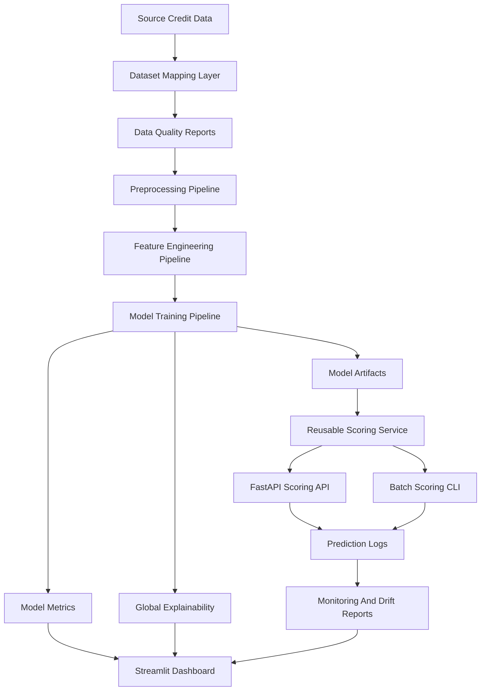
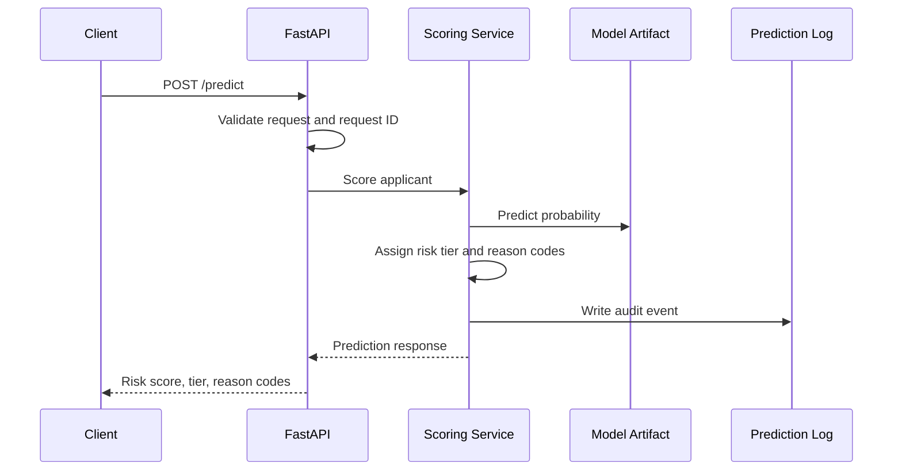
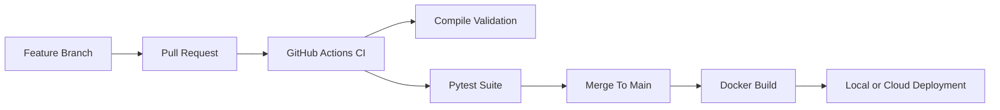
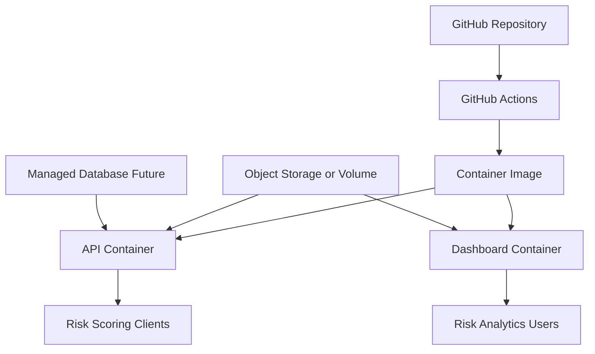

# Architecture Diagrams

## Platform Architecture

```mermaid
flowchart TD
    A[Source Credit Data] --> B[Dataset Mapping Layer]
    B --> C[Data Quality Reports]
    C --> D[Preprocessing Pipeline]
    D --> E[Feature Engineering Pipeline]
    E --> F[Model Training Pipeline]
    F --> G[Model Artifacts]
    F --> H[Model Metrics]
    F --> I[Global Explainability]
    G --> J[Reusable Scoring Service]
    J --> K[FastAPI Scoring API]
    J --> L[Batch Scoring CLI]
    K --> M[Prediction Logs]
    L --> M
    M --> N[Monitoring And Drift Reports]
    H --> O[Streamlit Dashboard]
    I --> O
    N --> O
```

## API Request Flow

```mermaid
sequenceDiagram
    participant Client
    participant API as FastAPI
    participant Service as Scoring Service
    participant Model as Model Artifact
    participant Logs as Prediction Log

    Client->>API: POST /predict
    API->>API: Validate request and request ID
    API->>Service: Score applicant
    Service->>Model: Predict probability
    Service->>Service: Assign risk tier and reason codes
    Service->>Logs: Write audit event
    Service-->>API: Prediction response
    API-->>Client: Risk score, tier, reason codes
```

## MLOps Workflow

```mermaid
flowchart LR
    A[Feature Branch] --> B[Pull Request]
    B --> C[GitHub Actions CI]
    C --> D[Compile Validation]
    C --> E[Pytest Suite]
    E --> F[Merge To Main]
    F --> G[Docker Build]
    G --> H[Local or Cloud Deployment]
```

## Deployment Topology

```mermaid
flowchart TD
    A[GitHub Repository] --> B[GitHub Actions]
    B --> C[Container Image]
    C --> D[API Container]
    C --> E[Dashboard Container]
    F[Object Storage or Volume] --> D
    F --> E
    G[Managed Database Future] --> D
    D --> H[Risk Scoring Clients]
    E --> I[Risk Analytics Users]
```
